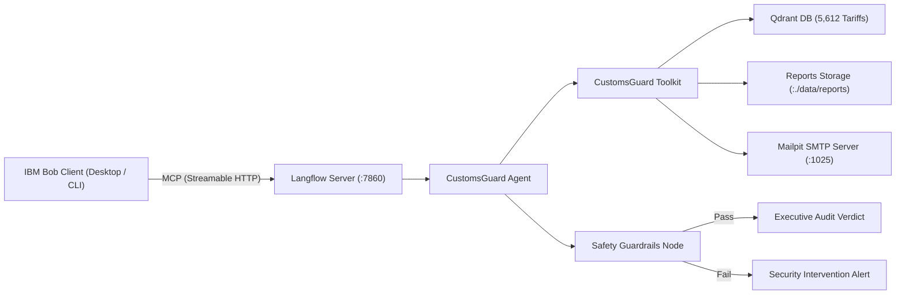

# CustomsGuard

[](https://x.com/rafifmsn)
[](https://github.com/astral-sh/uv)

**Autonomous Trade Compliance & Tariff Discrepancy Engine**  
_IBM SkillsBuild x Hacktiv8 National Hackathon 2026 (Productivity & Smart Business)_

CustomsGuard is an autonomous enterprise AI agent designed to audit commercial shipping invoices, eliminate port container detentions, detect customs tariff discrepancies, and protect cross-border businesses from regulatory penalties.

<video src="https://github.com/user-attachments/assets/bacb2242-b02d-41cb-ada0-c51904311d83" controls width="100%"></video>

## The Problem & Strategic Context

Manual paperwork and documentation bottlenecks cost the global shipping ecosystem $6.5 billion in direct costs annually while holding back up to $40 billion in cross-border trade.[^mckinsey-trade] While digital trade initiatives target multi-billion-dollar documentation delays, digitizing manifests does not eliminate the operational burden of verifying trade compliance.

In Indonesia, cross-border clearance aligns with the Directorate General of Customs and Excise (DJBC) regulatory framework, evaluated against 5,612 standardized 6-digit Harmonized System (HS) subheadings sourced from the WTO/UNCTAD International Trade Centre (ITC) Market Access Map (MAcMap) dataset.

- **Manual Verification Bottleneck**: Compliance teams spend 2 to 4 hours per manifest manually verifying invoices against dynamic tariff schedules and ministry import restrictions (Lartas).
- **Catastrophic Port Demurrage**: Documentation errors or missing permits trigger customs "Red Lane" holds, incurring steep daily container detention and port storage penalties.
- **Severe Administrative Surcharges**: Indonesian customs regulations impose fines ranging from **100% to 1,000%** on duty underpayments resulting from misdeclaration.[^uu-kepabeanan]
- **Unclaimed Duty Restitution**: Importers frequently overpay duties due to conservative classifications, losing thousands in unrecovered tax refunds.

CustomsGuard transforms this manual routine into a deterministic, sub-5-second audit pipeline that runs entirely on-premise (air-gapped) for maximum commercial confidentiality.

## System Architecture

CustomsGuard connects a local multi-service backend with IBM Bob via the Model Context Protocol (MCP):



- **IBM Bob**: Desktop conversational interface and CLI orchestrator.
- **Model Context Protocol (MCP)**: Standardized protocol exposing the Langflow workflow as a callable client tool.
- **Langflow Execution Engine**: Visual pipeline coordinating LLM reasoning, toolkit execution, and guardrails.
- **Qdrant Vector Database**: Local vector and full-text index seeded with 5,612 Indonesian HS codes, official duties, and permit tags.
- **Safety Guardrails**: Sanitizes Personally Identifiable Information (PII), blocks prompt injections in invoice descriptions, and prevents token leaks.
- **Mailpit SMTP**: Local mail server for simulated real-time container detention alert dispatching.

## Core Capabilities

1. **Autonomous Tariff RAG**: Matches declared item descriptions against 5,612 official Indonesian HS codes in milliseconds.
2. **Regulatory License Verification**: Cross-references mandatory pre-import approvals (SDPPI Kemkominfo, Kemenkes, BPOM).
3. **Grounded Demurrage & Detention Modeling**: Benchmarks container detention liabilities against the official CMA CGM Indonesia published tariff schedule (5 free days, progressive day-slabs, defaulting to 40ft Dry Standard if container size is omitted).
4. **Duty Restitution Discovery**: Detects over-declared duties, proactively identifying tax refund recovery opportunities.
5. **Automated Evidence Archiving**: Generates timestamped Markdown and JSON dossiers in `./data/reports/YYYY-MM-DD/{shipment_id}/`.
6. **Real-Time SMTP Alerting**: Automatically dispatches detention alert emails to compliance officers when high-risk cargo is flagged.

## Quickstart Guide

### 1. Prerequisites

- Docker and Docker Compose
- Python 3.10+ (or Astral `uv`)
- IBM Bob Desktop Application

### 2. Start the Docker Services

Clone the repository and launch the container ecosystem:

```bash
docker compose up -d
```

Service endpoints:

- **Langflow Canvas**: `http://localhost:7860` (Username: `admin`, Password: `admin123`)
- **Mailpit Web UI**: `http://localhost:8025`
- **Qdrant REST API**: `http://localhost:6333`
- **PostgreSQL**: `localhost:5432`

### 3. Seed the Customs Tariff Database

Index all 5,612 official Indonesian HS codes, duty rates, and permit regulations into Qdrant:

```bash
uv run python scripts/seed_qdrant.py
```

## Running Automated Tests

CustomsGuard includes an automated test suite verifying database integrity, discrepancy detection logic, multi-container demurrage scaling, duty restitution math, and reporting:

```bash
uv run pytest
```

_(Runs 14 automated unit and integration tests in under 3 seconds)._

## Connecting with IBM Bob

1. Launch **IBM Bob Desktop**.
2. Navigate to **Settings** -> **MCP**.
3. Verify or add the configuration from `.bob/mcp.json`.
4. The `customsguard` tool will appear in your active tools list.
5. In IBM Bob, audit shipments using natural language, raw JSON, or the built-in skill:

```text
$audit-shipment SHP-2026-0042
```

6. Or run non-interactive verification directly using Bob CLI:

```bash
BOB_API_KEY="your_api_key_here" bob run --trust "Audit shipment SHP-2026-0042 using customsguard tool"
```

7. Inspect the audit results in Bob, check the exported report in `./data/reports/`, and preview the email alert in Mailpit (`http://localhost:8025`).

## Documentation & Scenarios Directory

| Category                     | Document                                                                     | Description                                                                                                    |
| :--------------------------- | :--------------------------------------------------------------------------- | :------------------------------------------------------------------------------------------------------------- |
| **Domain Analysis**          | [`docs/problem_solution.md`](./docs/problem_solution.md)                     | Deep analysis of customs bottlenecks, demurrage costs, and our AI solution.                                    |
| **Technical Architecture**   | [`docs/technical/architecture.md`](./docs/technical/architecture.md)         | Langflow canvas topology, node specifications, guardrails, and data contracts.                                 |
| **Design & Scope Decisions** | [`docs/technical/design_decisions.md`](./docs/technical/design_decisions.md) | Rationale behind flexible agent reasoning, permit verification, and enterprise roadmap.                        |
| **MCP Integration**          | [`docs/technical/mcp_setup.md`](./docs/technical/mcp_setup.md)               | Step-by-step connection guide for IBM Bob and Langflow MCP proxy.                                              |
| **Commercial Strategy**      | [`docs/business/business_canvas.md`](./docs/business/business_canvas.md)     | Business model canvas, ROI model, demurrage savings, and ~87% tech cost reduction.                             |
| **Prompts Library**          | [`prompts/`](./prompts/)                                                     | Modular prompts for high-risk audits, demurrage scaling, and duty restitution.                                 |
| **Test Invoices**            | [`data/seed/sample_invoices.json`](./data/seed/sample_invoices.json)         | Scenario invoice payloads with carrier, container metadata, and declared commodities.                          |
| **Reference Dossiers**       | [`expected-outputs/`](./expected-outputs/)                                   | Ground-truth reference audit reports matching each test scenario.                                              |
| **Source Tariff Data**       | [`docs/macmap.xlsx`](./docs/macmap.xlsx)                                     | Official WTO/UNCTAD International Trade Centre (ITC) Market Access Map (MAcMap) tariff schedule for Indonesia. |

[^mckinsey-trade]: Casanova, D., Dierker, D., Jensen, B., Hausmann, L., & Stoffels, J. (2022, November 29). The multi-billion-dollar paper jam: Unlocking trade by digitalizing documentation. McKinsey & Company. https://www.mckinsey.com/industries/logistics/our-insights/the-multi-billion-dollar-paper-jam-unlocking-trade-by-digitalizing-documentation

[^uu-kepabeanan]: Republic of Indonesia. Law No. 17 of 2006 amending Law No. 10 of 1995 on Customs (Undang-Undang Kepabeanan), Article 82(5) and Article 16(4); implemented via Government Regulation (PP) No. 39 of 2019.
