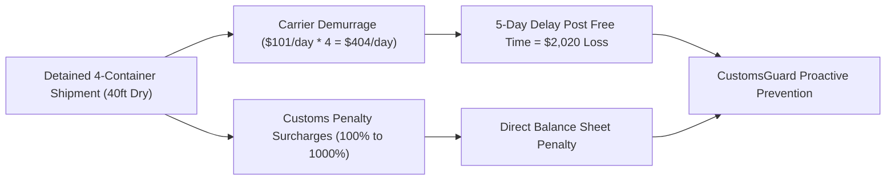
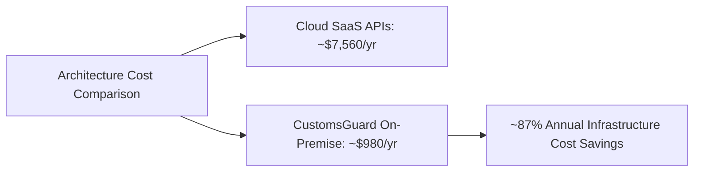

# CustomsGuard Business Model, ROI & Market Feasibility

This document presents the commercial feasibility, business model canvas, return on investment (ROI) calculations, and monetization roadmap for CustomsGuard.

## 1. Value Proposition & Economic ROI Model

In maritime shipping and cross-border logistics, customs documentation errors trigger immediate cargo holds:

### Direct Economic Value

1. **Demurrage Elimination**:
   Container detention holding fees are benchmarked against official CMA CGM Indonesia published tariff schedules (effective July 1, 2026), defaulting to a **40ft Standard Dry container** at **$101.00 USD per container per day** for Days 6 to 10.
   Preventing a single 5-day hold on a 4-container consignment saves **$2,020.00 USD** in direct cash bleed.
2. **Penalty Prevention**:
   In Indonesia, under-invoiced or misclassified customs duty attracts administrative surcharges ranging from 100% to 1,000% of the duty shortfall.[^uu-kepabeanan]
3. **Duty Restitution Discovery**:
   Identifies over-declared tariffs, directly unlocking legitimate tax refund claims.

## 2. Market Sizing (TAM, SAM, SOM)

- **Total Addressable Market (TAM)**:
  ASEAN Freight Forwarding & Logistics Market, valued at **$31.62 Billion USD in 2025** and projected to reach **$41.86 Billion USD by 2031** at a 4.78% CAGR.[^mordor-asean]
  Within the broader ASEAN logistics space ($288.24 Billion in 2025, reaching $406.10 Billion by 2031), freight forwarding complexity is surging due to ASEAN Single Window mandates and strict documentation requirements.[^randm-asean]
- **Serviceable Addressable Market (SAM)**:
  Indonesia Customs Brokerage Market, valued at **$2.23 Billion USD in 2025**, expanding to **$2.38 Billion USD in 2026** and **$3.32 Billion USD by 2031** at a 6.83% CAGR.[^mordor-id]
  Ocean and sea freight clearance accounts for 58.67% of this market ($1.31 Billion USD in 2025), with freight forwarder and 3PL-integrated brokerages commanding 68.74% of total clearance volume ($1.53 Billion USD).
  Tanjung Priok alone processes 8.30 million TEUs annually, where un-booked slot dwell times reach 7 to 10 days during congestion peaks.
- **Serviceable Obtainable Market (SOM)**:
  Digital-First & API-Based Customs Brokerages and Automated Compliance in Indonesia.
  Digital-first brokerages represent the fastest-growing segment in Indonesian customs clearance, expanding at a **15.34% CAGR** through 2031 to service mandatory CEISA 4.0 electronic filing, INSW Single Submission, and LARTAS permit verification.[^mordor-id]
  Capturing an initial 2.5% to 5.0% share of tech-enabled PPJK forwarders and digital clearance transactions represents an immediate serviceable beachhead of **$30 Million to $60 Million USD**.

## 3. Monetization Strategy

CustomsGuard adopts a hybrid B2B SaaS and transactional pricing model:

### 1. Tiered B2B SaaS Subscriptions

- **Starter ($299 USD / month)**:
  - Up to 500 shipment manifest audits per month.
  - Standard Qdrant tariff matching (5,612 Indonesian HS-6 subheadings from WTO/UNCTAD ITC MAcMap).
  - Email detention alerting via SMTP.
  - Intended for independent customs brokers and SME freight forwarders.
- **Professional ($899 USD / month)**:
  - Up to 3,000 shipment audits per month.
  - Multi-user seat access with human-in-the-loop review.
  - Automated daily compliance dossier archiving.
  - Intended for mid-tier logistics providers and trading houses.
- **Enterprise Air-Gapped ($2,500 USD / month + onboarding)**:
  - Unlimited shipment audits.
  - Fully air-gapped on-premise Docker deployment.
  - Custom vector database embeddings and priority regulatory updates.
  - Intended for multinational logistics corporations and port operators.

### 2. Transactional API Billing

- **$1.50 USD per audited commercial invoice** for on-demand low-volume importers.

## 4. Cost Engineering: Self-Hosted vs Cloud SaaS (CAPEX & OPEX)

| Expense Category          | Cloud SaaS Alternative                       | CustomsGuard On-Premise Docker                   | Annual Savings          |
| :------------------------ | :------------------------------------------- | :----------------------------------------------- | :---------------------- |
| **LLM Inference**         | Proprietary cloud APIs ($250/mo)             | Micro-routing / Local quantization ($15/mo)      | ~$2,820 USD / yr        |
| **Vector Database**       | Managed Pinecone / Qdrant Cloud ($120/mo)    | Self-hosted Qdrant on local Docker ($0/mo)       | ~$1,440 USD / yr        |
| **Data Egress & Storage** | Cloud bandwidth and audit retention ($80/mo) | Local disk storage and on-premise network ($0)   | ~$960 USD / yr          |
| **Hosting Compute**       | Cloud VM hosting ($180/mo)                   | Dedicated edge mini-server ($800 one-time CAPEX) | ~$1,360 USD / yr        |
| **Total Annual Cost**     | **~$7,560 USD / year**                       | **~$980 USD (Year 1, hardware included)**        | **~87% Cost Reduction** |

[^uu-kepabeanan]: Republic of Indonesia. Law No. 17 of 2006 amending Law No. 10 of 1995 on Customs (Undang-Undang Kepabeanan), Article 82(5) and Article 16(4); implemented via Government Regulation (PP) No. 39 of 2019.

[^mordor-asean]: Mordor Intelligence, "ASEAN Freight Forwarding Market Analysis (2026-2031)", 2026.

[^randm-asean]: Research and Markets, "ASEAN Freight and Logistics Market Share Analysis (2026-2031)", Report ID 5759301, 2026.

[^mordor-id]: Mordor Intelligence, "Indonesia Customs Brokerage Market Size & Share Analysis (2026-2031)", 2026.
