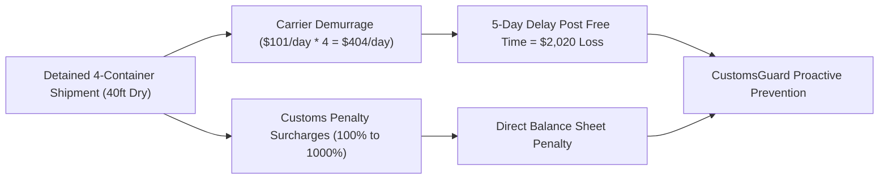
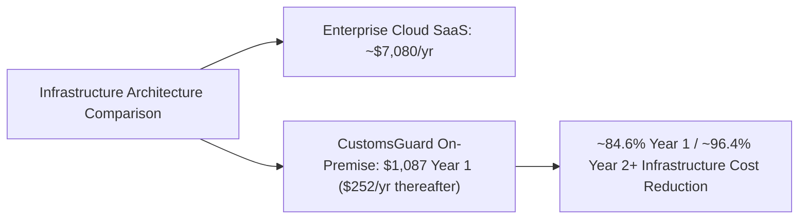

# CustomsGuard Business Model, ROI & Market Feasibility

This document presents the commercial feasibility, business model canvas, return on investment (ROI) calculations, cost engineering, and monetization roadmap for CustomsGuard.

## 1. Value Proposition & Economic ROI Model

In maritime shipping and cross-border logistics, customs documentation errors trigger immediate cargo holds, shunting containers into the customs Red Lane (Jalur Merah):

### Direct Economic Value Drivers

1. **Demurrage Elimination**:
   Container detention holding fees are benchmarked against official CMA CGM Indonesia published tariff schedules (effective July 1, 2026) [3], defaulting to a **40ft Standard Dry container** at **$101.00 USD per container per day** for Days 6 to 10.
   Preventing a single 5-day hold on a 4-container consignment saves **$2,020.00 USD** in direct cash bleed.
2. **Customs Penalty Surcharge Prevention**:
   Under Indonesian customs law, tariff misclassifications resulting in duty underpayment attract administrative surcharges ranging from 100% up to 1,000% of the duty shortfall [4].
   Avoiding a single $5,000 duty error saves an enterprise between $5,000 and $50,000 USD in unexpected fines.
3. **Duty Restitution Discovery**:
   Identifies over-declared tariffs (such as declaring 15% duty on processing servers whose official MFN rate is 0%), directly unlocking legitimate tax refund claims.

---

## 2. Market Sizing (TAM, SAM, SOM) & Operational Grounding

CustomsGuard targets a multi-billion dollar logistics market propelled by regional manufacturing reshoring and digital customs mandates:

| Market Metric                            | Valuation & Scope                                                                                                            | Operational Grounding & Key Dynamics                                                                                             | Source Citation                                                   |
| :--------------------------------------- | :--------------------------------------------------------------------------------------------------------------------------- | :------------------------------------------------------------------------------------------------------------------------------- | :---------------------------------------------------------------- |
| **Macro Trade Anchor**                   | $3.85 Trillion USD merchandise trade in goods ($2.35 Trillion USD waterborne); Indonesia Transport GDP at 983.5 Trillion IDR | High-volume maritime freight moving through Southeast Asian customs corridors                                                    | ASEAN Statistical Yearbook 2023 [5]                               |
| **Total Addressable Market (TAM)**       | $31.62 Billion USD in 2025, growing to $41.86 Billion USD by 2031 (4.78% CAGR)                                               | ASEAN Freight Forwarding market; broader ASEAN logistics sits at $288.24B (2025) reaching $406.10B (2031) at 5.82% CAGR          | Mordor Intelligence (2026) [2] / Research and Markets [7]         |
| **Serviceable Addressable Market (SAM)** | $2.23 Billion USD in 2025, expanding to $2.38 Billion USD in 2026 and $3.32 Billion USD by 2031 (6.83% CAGR)                 | Indonesian Customs Brokerage market; sea freight accounts for 58.67% ($1.31B USD) and 3PL/forwarders command 68.74% ($1.53B USD) | Mordor Intelligence (2026) [2]                                    |
| **Port Gateway Realities**               | 8.30 million TEUs (5.69 million container boxes) and 21.51 million non-container tons processed in 2025                      | Tanjung Priok terminal utilization; un-booked or document-flagged cargo queues 7 to 10 days before terminal clearance            | PT Pelindo Regional 2 Tanjung Priok [1] / Mordor Intelligence [2] |
| **Serviceable Obtainable Market (SOM)**  | $30 Million to $60 Million USD initial obtainable beachhead                                                                  | Digital-first and API-based brokerages growing at 15.34% CAGR; capturing 2.5% to 5.0% of digital transactions at Tanjung Priok   | Mordor Intelligence (2026) [2] / Pelindo Priok [1]                |

---

## 3. Monetization Strategy & Tiered B2B SaaS

CustomsGuard adopts a hybrid B2B subscription and transactional pricing model, structured specifically to lower adoption barriers for independent local customs brokers (PPJK) while capturing enterprise value from large logistics operators:

| Subscription Tier         | Monthly Fee                | Annualized Fee   | Monthly Audit Quota     | Target Customer Segment                                           | Core Features & SLA                                                                                                 |
| :------------------------ | :------------------------- | :--------------- | :---------------------- | :---------------------------------------------------------------- | :------------------------------------------------------------------------------------------------------------------ |
| **Starter**               | $149 USD / mo (~2.4M IDR)  | $1,788 USD / yr  | Up to 300 audits / mo   | Independent PPJK brokers & SME freight forwarders                 | Qdrant HS tariff matching (5,612 HS-6 subheadings), basic Lartas check, Mailpit SMTP alerts                         |
| **Professional**          | $599 USD / mo (~9.6M IDR)  | $7,188 USD / yr  | Up to 3,000 audits / mo | Mid-tier 3PL logistics providers & commercial trading houses      | Multi-seat human review, CMA CGM demurrage engine, duty restitution recovery, automated dossier archiving           |
| **Enterprise On-Premise** | $2,000 USD / mo (~32M IDR) | $24,000 USD / yr | Unlimited audits        | Multinational forwarders, ocean carriers, port terminal operators | Fully air-gapped on-premise Docker deployment, custom vector embeddings, priority regulatory updates, dedicated SLA |
| **Transactional API**     | $0.75 USD / audit          | Pay-as-you-go    | On-demand volume        | Low-volume importers & third-party software integrators           | On-demand REST API and Model Context Protocol (MCP) compliance audit per commercial invoice                         |

### Concrete Customer ROI & Payback Economics

1. **Starter Tier Payback ($149 / month = $1,788 / year)**:
   - Preventing just a single 5-day hold on a 4-container consignment saves **$2,020.00 USD** in direct CMA CGM demurrage fees [3].
   - A single avoided incident pays for more than an entire year of the Starter subscription ($1,788 USD).
2. **Professional Tier Payback ($599 / month = $7,188 / year)**:
   - Preventing just two delayed consignments ($4,040 USD saved) covers over 56% of the annual fee.
   - Avoiding a single minor customs duty shortfall fine of $10,000 USD under Indonesian Customs Law [4] completely covers the annual subscription multiple times over.
3. **Duty Restitution Discovery**:
   - In audited scenarios with over-declared duties (e.g. 15% declared vs 0% official on HS `8471.50` processing units), a single $100,000 shipment uncovers **$15,000.00 USD** in direct tax refund recovery, delivering instant positive ROI.

---

## 4. Cost Engineering: Self-Hosted vs Cloud SaaS (CAPEX & OPEX)

CustomsGuard's on-premise Docker architecture provides substantial cost advantages over brittle, cloud-dependent SaaS integrations.
While conventional enterprise compliance software relies on expensive multi-tenant cloud APIs and managed infrastructure, CustomsGuard executes locally on dedicated edge hardware.

### A. Enterprise Cloud SaaS Alternative Architecture

A typical cloud-hosted compliance stack handling ~3,000 monthly audit payloads incurs significant monthly operational expenditures across compute, database, network egress, and AI tokens:

| Expense Component                        | Technical Specification                                                                 | Monthly Fee     | Annual Cost              |
| :--------------------------------------- | :-------------------------------------------------------------------------------------- | :-------------- | :----------------------- |
| **Cloud Hosting Compute**                | 1x AWS EC2 `t4g.xlarge` (4 vCPU, 16GB RAM) Linux instance in Jakarta/Singapore region   | $105.00 USD     | $1,260.00 USD            |
| **Managed Vector Database**              | Qdrant Cloud Starter / Pinecone Standard dedicated node (4GB RAM, 10GB index)           | $95.00 USD      | $1,140.00 USD            |
| **Cloud LLM Inference Tokens**           | Blended commercial API tokens (~2,800 tokens per audit across reasoning and Guardrails) | $150.00 USD     | $1,800.00 USD            |
| **Network Egress & NAT Gateway**         | AWS Managed NAT Gateway ($0.059/hr) plus ~100GB audit dossier data egress ($0.11/GB)    | $60.00 USD      | $720.00 USD              |
| **Object Storage & Automated Snapshots** | AWS S3 Standard archive, 100GB GP3 EBS root volume, and daily automated snapshots       | $30.00 USD      | $360.00 USD              |
| **Network Security & VPN Tunnel**        | AWS Elastic IP address allocations and managed client/site-to-site VPN connection       | $50.00 USD      | $600.00 USD              |
| **Cloud SRE & DevOps Overhead**          | CloudWatch log monitoring, TLS certificate automation, and basic SLA support buffer     | $100.00 USD     | $1,200.00 USD            |
| **Total Cloud SaaS Stack**               | **Fully managed multi-tenant cloud infrastructure**                                     | **$590.00 USD** | **$7,080.00 USD / year** |

---

### B. CustomsGuard On-Premise Docker Architecture

By deploying as containerized microservices on an on-premise industrial edge mini-server, CustomsGuard eliminates ongoing cloud infrastructure markups:

#### 1. Hardware Capital Expenditures (One-Time CAPEX)

| Hardware Asset                   | Specification & Operational Purpose                                                            | Acquisition Cost |
| :------------------------------- | :--------------------------------------------------------------------------------------------- | :--------------- |
| **Industrial Edge Mini-Server**  | 8-core CPU, 32GB DDR5 RAM, 1TB NVMe PCIe 4.0 SSD, dual Gigabit Ethernet ports                  | $750.00 USD      |
| **Line-Interactive UPS Battery** | 650VA / 360W battery backup with Automatic Voltage Regulation (AVR) for power surge protection | $85.00 USD       |
| **Total Hardware CAPEX**         | **Complete turnkey physical appliance deployed at client premise or terminal**                 | **$835.00 USD**  |

_Amortization Note: Over a standard 3-year enterprise IT depreciation schedule, hardware CAPEX equates to **$278.33 USD / year**._

#### 2. Annual Operating Expenditures (Ongoing Direct OPEX)

| Operational Component         | Engineering Mechanism & Indonesian Market Reality                                          | Annual Cost     | Monthly Equivalent     |
| :---------------------------- | :----------------------------------------------------------------------------------------- | :-------------- | :--------------------- |
| **Commercial Electricity**    | Mini-server continuous draw of 35W = 306.6 kWh/year at PLN commercial rate (Rp 1,500/kWh)  | $29.11 USD      | $2.43 USD              |
| **Encrypted Cold Backup**     | Automated differential snapshot sync via Restic to Backblaze B2 / AWS S3 Glacier (100GB)   | $18.00 USD      | $1.50 USD              |
| **Local Network & Static IP** | Operates over existing PPJK broker office local area network (LAN) and office broadband    | $0.00 USD       | $0.00 USD              |
| **Vector DB & Core Engine**   | Self-hosted Qdrant Community Edition and Python runtime on Docker (Apache 2.0 Open Source) | $0.00 USD       | $0.00 USD              |
| **Hybrid Token Reserve**      | Deterministic calculations run locally; cloud LLM token reserve for multi-turn edge cases  | $180.00 USD     | $15.00 USD             |
| **Hardware Maintenance Fund** | Annual maintenance allocation for fan replacement, CMOS battery, and thermal maintenance   | $25.00 USD      | $2.08 USD              |
| **Total Direct Annual OPEX**  | **Total cash bleed required to run the on-premise system 24/7/365**                        | **$252.11 USD** | **$21.01 USD / month** |

---

### C. Total Cost of Ownership (TCO) & Net Savings Analysis

Comparing cumulative costs across 1-year and 3-year horizons demonstrates massive capital efficiency:

| Evaluation Horizon        | Cloud SaaS Alternative | CustomsGuard On-Premise Docker              | Net Dollar Savings  | Cost Reduction (%)  |
| :------------------------ | :--------------------- | :------------------------------------------ | :------------------ | :------------------ |
| **Year 1 (CAPEX + OPEX)** | $7,080.00 USD          | $1,087.11 USD ($835 CAPEX + $252.11 OPEX)   | **+$5,992.89 USD**  | **~84.65% Savings** |
| **Year 2 (Ongoing OPEX)** | $7,080.00 USD          | $252.11 USD (Direct operating cost)         | **+$6,827.89 USD**  | **~96.44% Savings** |
| **Year 3 (Ongoing OPEX)** | $7,080.00 USD          | $252.11 USD (Direct operating cost)         | **+$6,827.89 USD**  | **~96.44% Savings** |
| **3-Year Cumulative TCO** | **$21,240.00 USD**     | **$1,591.33 USD (Hardware + 3 Years OPEX)** | **+$19,648.67 USD** | **~92.51% Savings** |

---

### D. Startup Unit Economics & SaaS Gross Margins

Because CustomsGuard's marginal infrastructure serving cost is negligible, the subscription tiers yield exceptional enterprise software gross margins:

| Subscription Tier               | Monthly Revenue | Annual Revenue | Estimated Marginal Serving COGS    | Annual Gross Profit | Software Gross Margin |
| :------------------------------ | :-------------- | :------------- | :--------------------------------- | :------------------ | :-------------------- |
| **Starter Tier ($149/mo)**      | $149.00 USD     | $1,788.00 USD  | $15.00 USD / mo ($180.00 USD / yr) | $1,608.00 USD       | **~89.93% Margin**    |
| **Professional Tier ($599/mo)** | $599.00 USD     | $7,188.00 USD  | $38.00 USD / mo ($456.00 USD / yr) | $6,732.00 USD       | **~93.66% Margin**    |
| **Enterprise Tier ($2,000/mo)** | $2,000.00 USD   | $24,000.00 USD | $45.00 USD / mo ($540.00 USD / yr) | $23,460.00 USD      | **~97.75% Margin**    |

_Operational Context: On Enterprise deployments, the customer either provides their own on-premise server or pays the one-time $835 CAPEX as a pass-through deployment fee, allowing CustomsGuard to capture pure recurring high-margin software license revenue._

---

## 5. Core Solution Capabilities & Operational Value Matrix

CustomsGuard bridges commercial shipping documents and trade compliance through six deterministic capabilities:

| Solution Module                    | Technical Mechanism                                                                                   | Performance Metric                                                                                   | Enterprise Value                                                                                               |
| :--------------------------------- | :---------------------------------------------------------------------------------------------------- | :--------------------------------------------------------------------------------------------------- | :------------------------------------------------------------------------------------------------------------- |
| **Autonomous Tariff RAG**          | Vector cosine similarity retrieval across 5,612 Indonesian HS-6 subheadings in Qdrant [6]             | Vector query takes under 50ms; audit executes in 3 to 5 seconds                                      | Replaces 2 to 4 hours of manual tariff book searching with instant, deterministic classification               |
| **Lartas Permit Engine**           | Automated cross-referencing against 546 restricted commodity schedules (SDPPI, Kemenkes, BPOM) [9]    | Instant detection of missing ministerial distribution approvals                                      | Pre-empts Red Lane border seizures and eliminates 100% to 1,000% statutory customs fines [4]                   |
| **Carrier Demurrage Engine**       | Progressive day-slab calculator implementing CMA CGM Indonesia schedules (effective July 1, 2026) [3] | Evaluates container count, size, type, and projected days held; defaults safely to 40ft Dry Standard | Provides logistics teams with exact financial liability forecasts before port arrival                          |
| **Duty Restitution Discovery**     | Mathematical tariff difference analyzer comparing declared duty against official MFN schedules        | Detects overpayments (e.g. 15% declared vs 0% official on HS `8471.50`)                              | Unlocks legitimate tax refunds, transforming customs compliance from a cost center into a profit recovery tool |
| **Automated Evidentiary Dossiers** | Local disk export of timestamped Markdown and JSON audit dossiers to `./data/reports/`                | Programmatic, immutable audit trail generation                                                       | Provides certified documentation for post-clearance audits and tax authority verification                      |
| **Sub-Second Incident Alerting**   | Automated SMTP email alert dispatching via Mailpit (`localhost:8025`)                                 | Real-time notification dispatch when high-risk non-compliance is detected                            | Alerts operations coordinators days before container vessels berth at port                                     |

---

## 6. Authoritative Reference Citations & Regulatory Bases

- **[1] PT Pelindo Regional 2 Tanjung Priok (Ocean Week)**: Operational performance release confirming 8.30M TEUs (5.69M boxes) and 21.51M tons throughput in 2025. ([oceanweek.co.id](https://oceanweek.co.id/pelindo-priok-tangani-830-juta-teus-2151-juta-ton/))
- **[2] Mordor Intelligence**: _Indonesia Customs Brokerage Market Size & Share Analysis (2026-2031)_. Market size $2.23B in 2025 to $3.32B in 2031 (6.83% CAGR), 15.34% digital-first CAGR, and 7 to 10 day un-booked slot queue times. ([mordorintelligence.com](https://www.mordorintelligence.com/industry-reports/indonesia-customs-brokerage-market))
- **[3] CMA CGM Group**: _CMA CGM Indonesia Merged Import Demurrage & Detention Tariff_. Effective July 1, 2026. Establishes 5 free days for Standard Dry containers, progressive day-slabs ($101/day on Days 6 to 10 for 40ft Dry Standard), and 3 free days for Reefer containers. ([cma-cgm.com](https://www.cma-cgm.com/local/indonesia/news/630/adjustment-of-demurrage-amp-detention-tariffs))
- **[4] Republic of Indonesia Customs Law**: Law No. 17 of 2006 amending Law No. 10 of 1995 on Customs (Undang-Undang Kepabeanan), Articles 82(5) and 16(4); implemented via Government Regulation (PP) No. 39 of 2019, establishing 100% to 1,000% administrative surcharges.
- **[5] ASEAN Secretariat**: _ASEAN Statistical Yearbook 2023 (ASYB)_. Volume 19, ISSN 2986-3627, Jakarta: ASEAN Secretariat, December 2023. Confirms total ASEAN merchandise trade in goods of $3.85T USD ($2.35T waterborne) and Indonesia's Transportation and Storage sector GDP of 983.5T IDR.
- **[6] WTO / UNCTAD ITC MAcMap**: Market Access Map Customs Tariff Database. 5,612 Indonesian 6-digit Harmonized System subheadings, MFN tariff rates, and 546 restricted commodity schedules. ([macmap.org](https://www.macmap.org))
- **[7] Research and Markets**: _ASEAN Freight and Logistics Market Share Analysis (2026-2031)_. Report ID 5759301. Sizing broader ASEAN freight and logistics market from $288.24B (2025) to $406.10B by 2031 (5.82% CAGR). ([researchandmarkets.com](https://www.researchandmarkets.com/reports/5759301/asean-freight-logistics-market-share-analysis))
- **[8] MetaStat Insight**: _ASEAN Freight Forwarding Market (2026-2033)_. Forecasting ASEAN freight forwarding from $31.9B in 2025 to $46.1B by 2033 at a 4.7% CAGR. ([metastatinsight.com](https://metastatinsight.com/press-releases/asean-freight-forwarding-market))
- **[9] Ministry of Health & SDPPI Regulatory Decrees**: Ministry of Health Regulation Permenkes No. 5 of 2026 (medical devices) and Ministry of Communication and Digital / SDPPI certification decrees under Law No. 36 of 1999 (telecom equipment).
