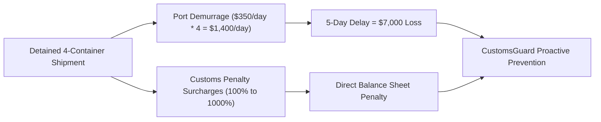
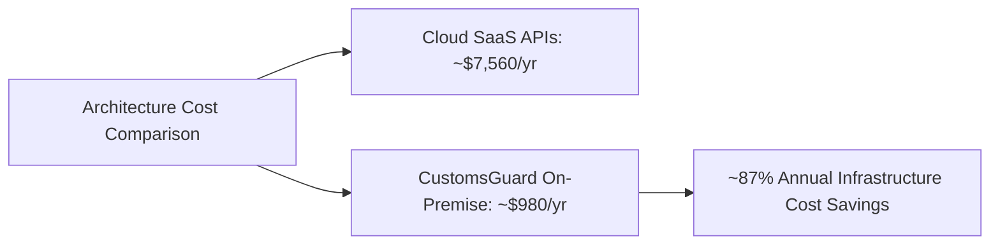

# CustomsGuard Business Model, ROI & Market Feasibility

This document presents the commercial feasibility, business model canvas, return on investment (ROI) calculations, and monetization roadmap for CustomsGuard.

## 1. Value Proposition & Economic ROI Model

In maritime shipping and cross-border logistics, customs documentation errors trigger immediate cargo holds:

### Direct Economic Value

1. **Demurrage Elimination**:
   Container detention costs average **$350.00 USD per 40ft container per day**.
   Preventing a single 5-day hold on a 4-container consignment saves **$7,000.00 USD** in direct cash bleed.
2. **Penalty Prevention**:
   In Indonesia, under-invoiced or misclassified customs duty attracts administrative surcharges ranging from 100% to 1,000% of the duty shortfall.
3. **Duty Restitution Discovery**:
   Identifies over-declared tariffs, directly unlocking thousands of dollars in legitimate tax refund claims.

## 2. Market Sizing (TAM, SAM, SOM)

- **Total Addressable Market (TAM)**:
  Global automated customs and trade compliance software market ($4.8 Billion USD by 2028, growing at 11.2% CAGR).
- **Serviceable Addressable Market (SAM)**:
  Southeast Asia (ASEAN) cross-border ocean freight forwarders and customs brokers processing ~120 million TEU annually ($380 Million USD).
- **Serviceable Obtainable Market (SOM)**:
  Indonesian licensed customs brokerage firms (PPJK), third-party logistics (3PL) providers, and import-export enterprises ($25 Million USD).

## 3. Monetization Strategy

CustomsGuard adopts a hybrid B2B SaaS and transactional pricing model:

### 1. Tiered B2B SaaS Subscriptions

- **Starter ($299 USD / month)**:
  - Up to 500 shipment manifest audits per month.
  - Standard Qdrant tariff matching (Indonesian BTKI schedule).
  - Email detention alerting via SMTP.
  - Intended for independent customs brokers and SME freight forwarders.
- **Professional ($899 USD / month)**:
  - Up to 3,000 shipment audits per month.
  - Multi-user seat access with human-in-the-loop review.
  - Automated daily compliance dossier archiving.
  - Intended for mid-tier logistics providers and trading houses.
- **Enterprise Air-Gapped ($2,500 USD / month + onboarding)**:
  - Unlimited shipment audits.
  - Fully air-gapped on-premise Docker deployment.
  - Custom vector database embeddings and priority regulatory updates.
  - Intended for multinational logistics corporations and port operators.

### 2. Transactional API Billing

- **$1.50 USD per audited commercial invoice** for on-demand low-volume importers.

## 4. Cost Engineering: Self-Hosted vs Cloud SaaS (CAPEX & OPEX)

| Expense Category          | Cloud SaaS Alternative                       | CustomsGuard On-Premise Docker                   | Annual Savings          |
| :------------------------ | :------------------------------------------- | :----------------------------------------------- | :---------------------- |
| **LLM Inference**         | Proprietary cloud APIs ($250/mo)             | Micro-routing / Local quantization ($15/mo)      | ~$2,820 USD / yr        |
| **Vector Database**       | Managed Pinecone / Qdrant Cloud ($120/mo)    | Self-hosted Qdrant on local Docker ($0/mo)       | ~$1,440 USD / yr        |
| **Data Egress & Storage** | Cloud bandwidth and audit retention ($80/mo) | Local disk storage and on-premise network ($0)   | ~$960 USD / yr          |
| **Hosting Compute**       | Cloud VM hosting ($180/mo)                   | Dedicated edge mini-server ($800 one-time CAPEX) | ~$1,360 USD / yr        |
| **Total Annual Cost**     | **~$7,560 USD / year**                       | **~$980 USD (Year 1, hardware included)**        | **~87% Cost Reduction** |
