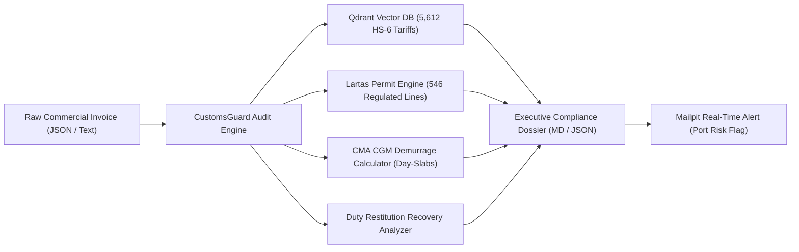
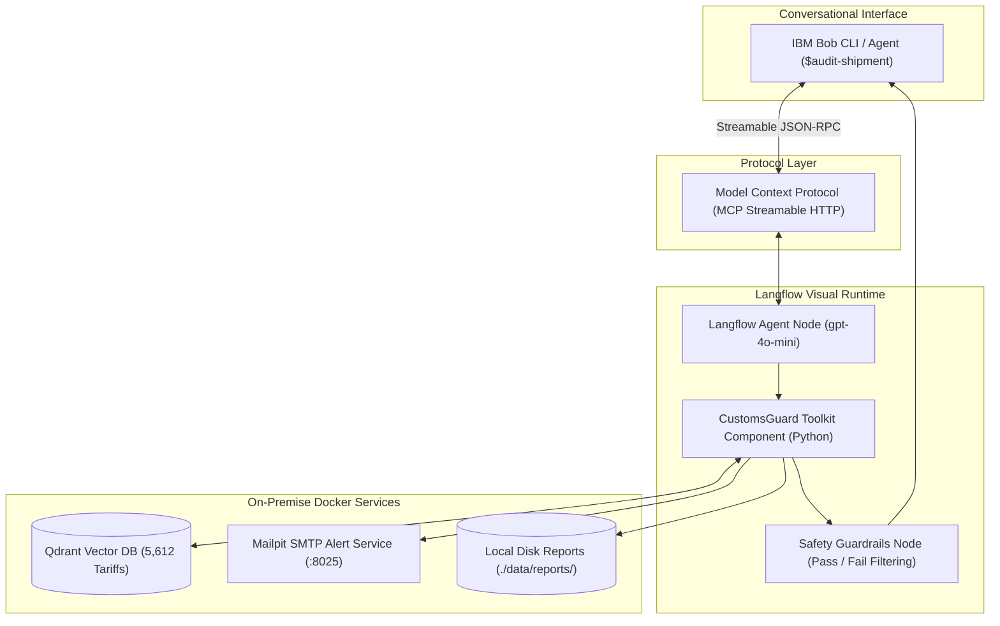

# CustomsGuard Presentation Pitch Deck (Draft 2)

This document provides a presentation deck outline for CustomsGuard, structured according to the official six-section hackathon agenda: **01 Overview**, **03 The Problem**, **04 The Solution**, **05 AI Agent**, **06 Impact**, and **07 Reference**.
Every empirical claim is attributed inline using "According to [Source] [X]" markers that cross-reference the numbered citations and asset links in section 07.

---

## Cover Slide

- **Slide Title**: CustomsGuard: Autonomous Trade Compliance & Tariff Discrepancy Engine
- **Subtitle**: Protecting Global Maritime Supply Chains from Costly Customs Holds and Penalties
- **Theme**: Productivity & Smart Business
- **Competition**: IBM SkillsBuild x Hacktiv8 National Hackathon 2026
- **Team**: CustomsGuard Engineering Team
- **Spoken Script (30 seconds)**:
  "Good day, distinguished judges and audience.
  We are proud to present CustomsGuard, an autonomous enterprise AI agent designed to audit commercial shipping manifests, prevent catastrophic container detention fees, and eliminate customs penalty surcharges before ocean cargo ever berths at port."

---

## Table of Contents (TOC)

```text
==================================================
              TABLE OF CONTENTS
==================================================
  01  Overview
  03  The Problem
  04  The Solution
  05  AI Agent
  06  Impact
  07  Reference
==================================================
```

- **Section Agenda & Deck Navigation**:
  International supply chains lose billions each year to avoidable customs clearance bottlenecks, paperwork errors, and container storage fees.
  This presentation outlines how CustomsGuard bridges enterprise shipping documents and customs compliance using IBM Bob, Langflow, and local vector RAG.

- **Agenda Items**:
  - **01 Overview**: Executive summary, operational mission, and market context.
  - **03 The Problem**: The port detention crisis, tariff classification maze, and regulatory permit traps.
  - **04 The Solution**: Deterministic multi-container audit engine, carrier demurrage modeling, and restitution recovery.
  - **05 AI Agent**: System architecture, IBM Bob MCP orchestration, and Responsible AI guardrails.
  - **06 Impact**: Validated market sizing (TAM/SAM/SOM), customer ROI calculations, cost engineering, and test verification.
  - **07 Reference**: Formal bibliographic citations, statutory bases, and visual asset source links.

---

## 01 Overview

### Executive Summary & Operational Mission

CustomsGuard is an autonomous trade compliance copilot built for freight forwarders, third-party logistics (3PL) providers, licensed customs brokers (PPJK), and corporate trade compliance officers.
The system inspects commercial invoices and packing lists in seconds, cross-referencing declared items against official customs tariffs to identify misclassifications, detect missing mandatory import permits, and compute exact financial exposure.

### Macroeconomic Trade Foundation

Cross-border merchandise trade represents the foundation of Southeast Asian economic growth.
According to the ASEAN Secretariat in the ASEAN Statistical Yearbook 2023 [5], total merchandise trade in goods across ASEAN reached $3.85 trillion USD in 2022.
Of that total, $2.35 trillion USD moved across maritime waterways, underscoring the critical role of container shipping.
In Indonesia specifically, the Transportation and Storage sector generates 983.5 trillion IDR in annual GDP, according to the ASEAN Statistical Yearbook 2023 [5].
However, documentary friction continues to bottleneck port terminals.
According to Mordor Intelligence [2], traditional customs brokerages still process 76.24% of Indonesian clearances manually, leading to avoidable clearance queues and heavy operational expenses.

### Target User Segments

| User Persona | Organization Type | Primary Operational Challenge | CustomsGuard Solution |
| :--- | :--- | :--- | :--- |
| **Customs Broker (PPJK)** | Independent brokerage agency | Spending 20 to 30 minutes manually looking up HS codes per line item | Sub-5-second automated HS code classification and duty calculation |
| **Logistics Lead** | Freight forwarder / 3PL provider | Escalating container demurrage bills caused by Red Lane cargo inspections | Pre-arrival carrier demurrage burn rate calculation and detention alerting |
| **Trade Officer** | Multinational enterprise importer | Overpaying customs tariffs without claiming eligible refunds | Automated tariff overpayment detection unlocking customs duty restitution |

- **Spoken Script (45 seconds)**:
  "Cross-border merchandise trade across ASEAN exceeds 3.8 trillion dollars annually, with over 2.3 trillion dollars moving by sea, according to the ASEAN Statistical Yearbook [5].
  In Indonesia, transportation and logistics account for over 980 trillion rupiah of domestic output [5].
  Yet, according to Mordor Intelligence [2], over 76 percent of Indonesian customs clearances still rely on manual paper processing.
  Compliance officers spend hours checking tariff schedules line by line.
  CustomsGuard automates this workflow into a sub-5-second audit, ensuring cargo moves smoothly while protecting corporate balance sheets."

---

## 03 The Problem

### The Gateway Reality: Port Congestion and Detention Slabs

Indonesia's primary maritime gateway, Tanjung Priok in Jakarta, operates at intense capacity.
According to PT Pelindo Regional 2 Tanjung Priok as reported by Ocean Week [1], Tanjung Priok handled 8.30 million TEUs (representing 5.69 million container boxes) and 21.51 million tons of non-container cargo in 2025.
When documentation contains errors, containers cannot be released and are shunted into the customs Red Lane (Jalur Merah) for physical inspection.
According to market research by Mordor Intelligence [2], cargo lacking pre-booked appointment slots or held up by documentary discrepancies queues 7 to 10 days before terminal clearance.

### The Carrier Demurrage Trap

While containers sit inside port terminals, ocean carriers enforce combined Demurrage and Detention (D&D) charges.
According to the official published tariff schedule of CMA CGM Indonesia (effective July 1, 2026) [3], shippers receive only 5 free days for standard dry containers.
Beginning on Day 6, progressive daily rate slabs apply:
- Days 6 to 10: $101.00 USD per day for a 40ft Standard Dry container.
- Days 11 to 15: $121.00 USD per day.
- Days 16 to 20: $151.00 USD per day.
- Day 21 and beyond: $161.00 USD per day.

For a standard 4-container consignment held for 5 days beyond free time (Days 6 to 10), an importer suffers an avoidable cash bleed of:
$$4 \text{ containers} \times \$101.00/\text{day} \times 5 \text{ days} = \$2,020.00 \text{ USD.}$$

### Regulatory Permit Traps & Heavy Customs Surcharges

1. **Invisible Non-Tariff Barriers (Lartas)**:
   According to the official Indonesian customs tariff database maintained by the WTO and UNCTAD International Trade Centre (ITC MAcMap) [6], the national schedule contains 5,612 active 6-digit HS subheadings.
   Exactly 546 of these subheadings (9.73%) require mandatory pre-import approvals:
   - **SDPPI Certification**: Mandatory for wireless and telecommunications devices under Kominfo regulations [9].
   - **Distribution Licenses (Izin Edar)**: Mandatory for medical equipment and diagnostic reagents under Ministry of Health Regulation Permenkes No. 5 of 2026 [9].
   - **BPOM Approvals**: Mandatory for food, pharmaceuticals, and cosmetics [9].
   If cargo arrives without these licenses, customs authorities cannot release the goods, triggering indefinite storage detention.

2. **Severe Administrative Fines**:
   According to Indonesian Customs Law No. 17 of 2006 amending Law No. 10 of 1995 (Undang-Undang Kepabeanan), Articles 82(5) and 16(4), implemented under Government Regulation PP No. 39 of 2019 [4], tariff misclassifications resulting in duty underpayment attract administrative surcharges between 100% and 1,000% of the unpaid duty shortfall.

3. **Unclaimed Duty Restitution**:
   Importers frequently declare conservative default tariff rates (e.g., 15%) on items whose legal rate is 0% or 5%, leaving thousands of dollars in unrecovered tax refunds unclaimed on every manifest.

- **Spoken Script (45 seconds)**:
  "According to PT Pelindo Regional 2 [1], Tanjung Priok processed 8.30 million TEUs in 2025.
  According to Mordor Intelligence [2], shipments flagged for documentary errors queue 7 to 10 days before terminal clearance.
  Under CMA CGM Indonesia tariffs [3], a 5-day hold on a 4-container shipment inflicts over two thousand dollars in direct demurrage bleed.
  Furthermore, according to the ITC MAcMap database [6], 546 Indonesian HS subheadings require pre-import permits.
  Missing a permit traps cargo indefinitely and triggers administrative penalties between 100 and 1,000 percent under Indonesian Customs Law [4]."

---

## 04 The Solution

### Deterministic Multi-Container Compliance Engine

CustomsGuard transforms hours of error-prone manual tariff verification into an automated, deterministic audit completed in under 5 seconds.
The engine reads incoming commercial invoices, parses line item descriptions, queries an on-premise vector database, and executes mathematical risk modeling.



### Core Solution Capabilities

| Engine Capability | Underlying Mechanism | Technical Benchmark | Concrete Business Value |
| :--- | :--- | :--- | :--- |
| **Autonomous Tariff RAG** | Vector cosine similarity retrieval across 5,612 Indonesian HS-6 subheadings in Qdrant [6] | Vector lookup takes under 50ms; total pipeline executes in 3 to 5 seconds | Replaces 2 to 4 hours of manual tariff book searching with instant, deterministic classification |
| **Regulatory Permit Verification** | Automated cross-referencing against 546 restricted commodity schedules (SDPPI, Kemenkes, BPOM) [9] | Instant detection of missing ministerial distribution approvals | Prevents Red Lane border detentions and avoids 100% to 1,000% statutory customs fines [4] |
| **CMA CGM Demurrage Modeling** | Progressive rate-slab engine implementing CMA CGM Indonesia schedules (July 1, 2026) [3] | Computes daily burn rates and cumulative exposure; defaults safely to 40ft Dry Standard | Provides logistics teams with exact financial liability forecasts before port arrival |
| **Duty Restitution Discovery** | Mathematical tariff difference analyzer comparing declared duty against official MFN schedules | Detects overpayments (e.g. 15% declared vs 0% official on HS `8471.50`) | Unlocks legitimate tax refunds, turning compliance into a proactive profit center |
| **Automated Evidentiary Dossiers** | Local disk export of timestamped Markdown and JSON audit dossiers to `./data/reports/` | Programmatic, immutable audit trail generation | Provides certified documentation for post-clearance audits and tax authority verification |
| **Sub-Second Incident Alerting** | Automated SMTP email alert dispatching via Mailpit (`localhost:8025`) | Real-time notification dispatch when high-risk non-compliance is detected | Alerts operations coordinators days before container vessels berth at port |

- **Spoken Script (45 seconds)**:
  "CustomsGuard replaces manual guesswork with an autonomous compliance pipeline.
  In 3 to 5 seconds, our semantic engine searches 5,612 official Indonesian tariffs, cross-references ministerial permit schedules, calculates exact duty shortfalls, and uncovers duty restitution opportunities.
  Crucially, it models container demurrage using official CMA CGM Indonesia day-slabs [3], defaulting gracefully to a 40ft dry standard container.
  When discrepancies are identified, CustomsGuard archives formal evidentiary dossiers locally and dispatches urgent email alerts to logistics teams."

---

## 05 AI Agent

### System Architecture & Model Context Protocol (MCP) Integration

CustomsGuard combines conversational AI and deterministic business logic through a clean, decoupled architecture:
1. **IBM Bob**: Serves as the developer and logistics co-pilot, accepting natural language instructions (`$audit-shipment`) or raw invoice JSON payloads.
2. **Model Context Protocol (MCP)**: Acts as the open integration bridge, allowing IBM Bob to invoke the Langflow backend execution engine as a registered tool (`customsguard`).
3. **IBM Langflow**: Orchestrates the agent flow, linking input nodes, LLM reasoning (gpt-4o-mini), custom Python tool components, and safety guardrails.
4. **Self-Hosted On-Premise Services**: Local Qdrant vector database (5,612 HS codes), PostgreSQL database, and Mailpit SMTP server run entirely inside Docker containers.



### Safety, Guardrails & Responsible AI Architecture

CustomsGuard enforces enterprise security and responsible AI principles at every stage of execution:

| Safety Dimension | Threat Mitigated | Technical Implementation | Operational Result |
| :--- | :--- | :--- | :--- |
| **PII & Data Redaction** | Leakage of Indonesian Tax IDs (NPWP), commercial bank accounts, and personal signatures | Regex and pattern-based redaction filters in Langflow Guardrails | Automatically masks sensitive commercial and personal identifiers before presentation |
| **Adversarial Defense** | Prompt injection attacks hidden in commodity item descriptions | Content safety evaluation node screening input payloads for prompt overrides | Intercepts adversarial text and routes execution safely to compliance fallback handlers |
| **Credential Masking** | Accidental exposure of API tokens, database strings, or SMTP credentials | Outbound payload regex screening | Prevents leakage of internal system credentials in logs or chat responses |
| **Air-Gapped Privacy** | Commercial espionage and leaking confidential supplier margins to external clouds | 100% self-hosted deployment running inside on-premise Docker containers | Sensitive commercial invoices and pricing agreements never leave corporate infrastructure |
| **Human-in-the-Loop** | Autonomous over-reliance or unauthorized customs declarations | Explicit advisory agent persona defined in `AGENTS.md` | CustomsGuard serves as an evidence engine; licensed human brokers maintain final release signoff |

- **Spoken Script (60 seconds)**:
  "Our architecture merges IBM Bob with Langflow via the open Model Context Protocol.
  Bob provides a natural co-pilot interface for logistics officers.
  Through MCP, Bob executes our Langflow agent pipeline, which queries our local Qdrant database containing 5,612 tariffs, writes audit dossiers to local disk, and dispatches real-time alerts.
  Our active Guardrails node screens incoming text for prompt injections and sanitizes sensitive tax IDs and bank accounts.
  Because the stack runs 100 percent locally inside Docker, corporate trade data never leaves enterprise walls.
  Most importantly, CustomsGuard respects human oversight: it calculates liabilities and provides certified evidence, but licensed trade professionals make the final release decision."

---

## 06 Impact

### Validated Market Opportunity (TAM, SAM, SOM)

CustomsGuard targets a massive, fast-growing market driven by regional manufacturing reshoring and digital customs mandates:

| Market Scope | Valuation & Forecast | Growth Driver & Segment Dynamics | Source Citation |
| :--- | :--- | :--- | :--- |
| **Macro Trade Anchor** | $3.85 Trillion USD merchandise trade in goods ($2.35 Trillion USD waterborne); Indonesia Transport GDP at 983.5 Trillion IDR | Massive regional maritime merchandise volume passing through Southeast Asian customs corridors | ASEAN Statistical Yearbook 2023 [5] |
| **Total Addressable Market (TAM)** | $31.62 Billion USD in 2025, reaching $41.86 Billion USD by 2031 (4.78% CAGR) | ASEAN Freight Forwarding market; broader ASEAN logistics sits at $288.24B (2025) reaching $406.10B (2031) at 5.82% CAGR | Mordor Intelligence (2026) [2] / Research and Markets [7] |
| **Serviceable Addressable Market (SAM)** | $2.23 Billion USD in 2025, expanding to $2.38 Billion USD in 2026 and $3.32 Billion USD by 2031 (6.83% CAGR) | Indonesian Customs Brokerage market; sea freight accounts for 58.67% ($1.31B USD) and 3PL/forwarders command 68.74% ($1.53B USD) | Mordor Intelligence (2026) [2] |
| **Serviceable Obtainable Market (SOM)** | $30 Million to $60 Million USD initial obtainable beachhead | Digital-first and API-based brokerages growing at 15.34% CAGR; capturing 2.5% to 5.0% of digital transactions at Tanjung Priok | Mordor Intelligence (2026) [2] / Pelindo Priok [1] |

### Commercial Business Model & SaaS Pricing

CustomsGuard operates on a hybrid B2B subscription and transactional API billing model:

| Subscription Tier | Monthly Fee | Annualized Fee | Target Customer | Features & Limits |
| :--- | :--- | :--- | :--- | :--- |
| **Starter** | $299 USD / mo | $3,588 USD / yr | Independent PPJK brokers & SME forwarders | Up to 500 audits/month, Qdrant tariff lookup, Mailpit SMTP alerts |
| **Professional** | $899 USD / mo | $10,788 USD / yr | Mid-tier logistics providers & trading houses | Up to 3,000 audits/month, multi-seat human review, automated dossier archiving |
| **Enterprise Air-Gapped** | $2,500 USD / mo | $30,000 USD / yr | Multinational forwarders, ocean carriers, port terminals | Unlimited audits, dedicated on-premise Docker deployment, custom embeddings |
| **Transactional API** | $1.50 USD / audit | Pay-as-you-go | Low-volume importers & occasional filers | On-demand REST/MCP API compliance audit per commercial invoice |

### Concrete Customer ROI & Cost Engineering

1. **Immediate Payback from Demurrage Prevention**:
   According to CMA CGM Indonesia's tariff schedule [3], a 5-day hold on a 4-container consignment costs **$2,020.00 USD** in direct carrier detention fees.
   Preventing just two delayed consignments per year completely covers the entire annual cost of a Professional tier subscription ($10,788 USD / yr).
2. **Customs Fine Elimination**:
   Avoiding a single $5,000 duty miscalculation prevents administrative penalty surcharges of **$5,000 to $50,000 USD** under Indonesian Customs Law [4].
3. **Infrastructure Cost Advantage (~87% Savings)**:
   - Typical Cloud SaaS alternative (proprietary LLM APIs, managed vector DB, cloud hosting, egress): ~$7,560 USD / year.
   - CustomsGuard On-Premise Docker stack (local Qdrant, quantized embeddings, edge mini-server): ~$980 USD Year 1 (hardware included) and ~$180 USD / year thereafter.
   - Delivers an immediate **~87% infrastructure cost reduction** while ensuring absolute data sovereignty.

### Live Prototype Verification Status

The entire CustomsGuard codebase is verified and backed by an automated test suite:
- **14 of 14 Automated Tests Passing** (executed via `uv run pytest` in 49.08s).
- 100% test pass rate across core audit logic, CMA CGM progressive matrix calculations, duty restitution recovery, report file generation, Mailpit SMTP alerting, and the live IBM Bob CLI orchestrator via MCP.

- **Spoken Script (45 seconds)**:
  "According to Mordor Intelligence [2], the Indonesian customs brokerage market is valued at 2.23 billion dollars, with digital-first compliance growing at over 15 percent annually.
  Our business model delivers immediate ROI.
  Under official CMA CGM tariffs [3], preventing just one 5-day hold on a 4-container consignment saves 2,020 dollars in demurrage, while avoiding customs fines up to 1,000 percent under Indonesian Customs Law [4].
  Furthermore, our self-hosted Docker architecture slashes annual infrastructure costs by 87 percent compared to cloud APIs.
  CustomsGuard is fully built and verified today, backed by 14 passing automated tests and live MCP integration in IBM Bob."

---

## 07 Reference

### Authoritative Bibliographic Citations & Regulatory References

- **[1] PT Pelindo Regional 2 Tanjung Priok (Ocean Week)**:  
  *Operational Performance Release: Arus Petikemas Mencapai 8,30 Juta TEUs (5,69 Juta Box) dan 21,51 Juta Ton Non-Petikemas di Pelabuhan Tanjung Priok Tahun 2025.* Reported via *Ocean Week*, published December 31, 2025 / January 1, 2026.  
  Official operational release confirming port throughput, container box counts, and terminal utilization.  
  **Link**: https://oceanweek.co.id/pelindo-priok-tangani-830-juta-teus-2151-juta-ton/  
  *Visual Asset Note*: Contains executive photos and operational throughput indicators suitable for slide callouts.

- **[2] Mordor Intelligence (Indonesia Customs Brokerage Market)**:  
  *Indonesia Customs Brokerage Market Size & Share Analysis - Growth Trends & Forecasts (2026 - 2031).* Published by Mordor Intelligence, January 2026.  
  Confirms market size ($2.23B in 2025 to $3.32B in 2031 at 6.83% CAGR), digital-first brokerage CAGR of 15.34%, ocean clearance share (58.67%), forwarder-integrated broker share (68.74%), and 7 to 10 day un-booked slot queue times at Tanjung Priok.  
  **Link**: https://www.mordorintelligence.com/industry-reports/indonesia-customs-brokerage-market  
  *Visual Asset Note*: Features segmentation market share pie charts and CAGR growth bar charts.

- **[3] CMA CGM Group (Indonesia Demurrage & Detention Tariff)**:  
  *CMA CGM Indonesia Merged Import Demurrage & Detention Tariff Schedules.* Effective July 1, 2026.  
  Official carrier schedule establishing 5 free days for Standard Dry containers, progressive day-slabs ($101/day for Days 6 to 10 for 40ft Dry Standard containers, rising to $161/day after Day 21), and 3 free days for Reefer containers ($141/day to $180/day).  
  **Link**: https://www.cma-cgm.com  
  *Visual Asset Note*: Features carrier tariff matrices and container slab progression diagrams.

- **[4] Republic of Indonesia Customs Law (UU Kepabeanan)**:  
  *Law No. 17 of 2006 amending Law No. 10 of 1995 on Customs (Undang-Undang Kepabeanan).* Articles 82(5) and 16(4); implemented via Government Regulation (PP) No. 39 of 2019.  
  Statutory mandate establishing administrative penalty surcharges of 100% to 1,000% of customs duty shortfalls resulting from tariff misclassification or under-invoicing.

- **[5] ASEAN Secretariat (ASEAN Statistical Yearbook 2023)**:  
  *ASEAN Statistical Yearbook 2023 (ASYB).* Volume 19, ISSN 2986-3627. Published by the ASEAN Secretariat, Jakarta, December 2023.  
  Authoritative macroeconomic statistics confirming total ASEAN merchandise trade in goods of $3.85 trillion USD in 2022 ($2.35 trillion USD transported by waterborne vessels) and Indonesia's Transportation and Storage sector GDP of 983.5 trillion IDR.  
  **Link**: https://www.asean.org  
  *Visual Asset Note*: Official trade tables (Table 5.1 and Table 5.6) documenting modal transport volume splits.

- **[6] WTO / UNCTAD International Trade Centre (ITC MAcMap)**:  
  *Market Access Map (MAcMap) Customs Tariff Database.* Jointly managed by the World Trade Organization (WTO) and United Nations Conference on Trade and Development (UNCTAD), Geneva.  
  Official dataset containing 5,612 Indonesian 6-digit Harmonized System (HS) subheadings, Most-Favoured-Nation (MFN) tariff rates, and non-tariff measure cross-references.  
  **Link**: https://www.macmap.org  
  *Visual Asset Note*: Features HS tariff search trees and trade map visualizations.

- **[7] Research and Markets (ASEAN Freight and Logistics Market)**:  
  *ASEAN Freight and Logistics Market Share Analysis - Growth Trends & Forecasts (2026 - 2031).* Report ID 5759301. Published by Research and Markets, 2026.  
  Market valuation sizing the broader ASEAN freight and logistics market at $288.24 Billion USD in 2025, reaching $406.10 Billion USD by 2031 at a 5.82% CAGR.  
  **Link**: https://www.researchandmarkets.com/reports/5759301/asean-freight-logistics-market-share-analysis  
  *Visual Asset Note*: Features logistics function breakdowns across freight transport, forwarding, and warehousing.

- **[8] MetaStat Insight (ASEAN Freight Forwarding Market)**:  
  *ASEAN Freight Forwarding Market Size, Share, Industry Analysis, Growth, Trends, and Forecast 2026-2033.* Published by MetaStat Insight, 2026.  
  Forecasts ASEAN freight forwarding growing from $31.9 Billion USD in 2025 to $46.1 Billion USD by 2033 at a 4.7% CAGR, with sea freight forwarding expanding to $23.8 Billion USD.  
  **Link**: https://metastatinsight.com/press-releases/asean-freight-forwarding-market  
  *Visual Asset Note*: Features transport mode share graphs (sea freight vs air freight).

- **[9] Ministry of Health & SDPPI Regulatory Decrees**:  
  *Ministry of Health, Republic of Indonesia: Regulation Permenkes No. 5 of 2026 on Importation of Medical Devices via INSW Pathways;* and *Ministry of Communication and Digital: SDPPI Certification Mandates under Law No. 36 of 1999.*  
  Official statutory schedules governing mandatory pre-import permits for medical devices and telecommunication apparatus.

---

## Thank You / Closing Slide

- **Slide Title**: CustomsGuard: Smart Compliance for Resilient Supply Chains
- **Call to Action**: Empowering Trade Compliance Officers with Deterministic AI
- **Repository**: [https://github.com/rafifmsn/customs-guard](https://github.com/rafifmsn/customs-guard)
- **Spoken Script (30 seconds)**:
  "CustomsGuard bridges the gap between complex customs laws and daily shipping operations.
  By eliminating costly container holds, uncovering duty restitution, and safeguarding trade data on-premise, CustomsGuard protects enterprise supply chains and powers smarter global trade.
  Thank you for your time, and we welcome your questions."
