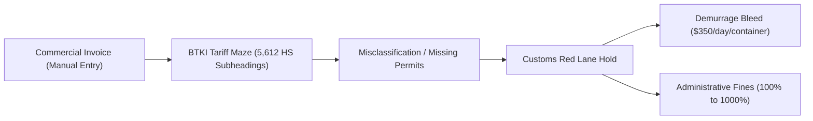
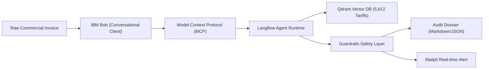

# CustomsGuard: Deep Problem Analysis & Solution Architecture

This document provides a comprehensive domain analysis of international trade compliance, customs bottlenecks, and the autonomous AI solution engineered by CustomsGuard.
It is written for trade practitioners, business stakeholders, and technical evaluators alike.

## 1. Domain Context: The High-Stakes World of Cross-Border Trade

Global merchandise trade now exceeds $26 trillion each year.[^unctad2025]  
Every container, pallet, and cross border parcel entering a country must clear national customs authorities before it reaches its final destination.

(Note: Total international trade including commercial services surpasses $35 trillion annually. The physical merchandise subset specifically represents over $26 trillion, all of which is subject to physical customs declarations, tariff classifications, and border control inspections.)

In Indonesia, international trade is governed by the Directorate General of Customs and Excise (DJBC / Bea Cukai) under the Indonesian Customs Tariff Book (Buku Tarif Kepabeanan Indonesia / BTKI).
Every commercial commodity must be declared with:

1. A valid 6-digit to 8-digit Harmonized System (HS) Code.
2. Accurate CIF (Cost, Insurance, and Freight) valuation.
3. Applicable Most-Favoured-Nation (MFN) or preferential trade duty rate.
4. Mandatory non-tariff import restrictions (Lartas) and ministry distribution permits.

## 2. The Core Problems: Why Cross-Border Trade Compliance is Broken

### Problem 1: The Tariff Classification Maze (BTKI Complexity)

- **The Challenge**: The tariff schedule contains 5,612 active 6-digit HS subheadings in Indonesia alone.
- Distinguishing between subtly different commodities requires hours of expert analysis.
  For example, declaring a cellular smartphone under computing machinery (`8471.30`) rather than telecommunications (`8517.11`) completely alters the regulatory framework.
- **The Bottleneck**: A typical freight forwarder compliance team spends 20 to 30 minutes manually looking up tariff books for every single line item on an invoice.

### Problem 2: Port Congestion and Demurrage Penalties ($350.00/day per container)

- When customs documentation contains an error, the shipment is shunted to the "Red Lane" (Jalur Merah) for physical inspection.
- While the cargo is detained at port terminals (such as Tanjung Priok or Tanjung Perak), terminal operators assess container demurrage and detention fees.
- **Measurable Impact**: Detention costs are modeled at a baseline of **$350.00 USD per container per day**.
  For a standard 4-container consignment detained for just 5 days, an enterprise incurs **$7,000.00 USD** in avoidable demurrage penalties.

### Problem 3: Invisible Non-Tariff Barriers (Lartas Permit Traps)

- Over 500 HS codes in Indonesia require mandatory pre-import approvals:
  - **SDPPI Certification (Kemkominfo)**: Mandatory for telecommunications and wireless devices.
  - **Distribution Permits (Izin Edar Kemenkes)**: Mandatory for medical devices and diagnostic apparatus.
  - **BPOM Approvals**: Mandatory for food, cosmetics, and pharmaceuticals.
- If cargo arrives at the port without these certificates already approved, customs officers cannot legally release the goods, causing indefinite cargo holding.

### Problem 4: The 100% to 1,000% Administrative Penalty Surcharge

- Under Indonesian customs law, tariff misclassifications resulting in duty underpayment attract administrative surcharges ranging from 100% up to 1,000% of the duty shortfall.[^uu-kepabeanan]
- A minor $5,000 duty miscalculation can result in an unexpected $50,000 corporate penalty.

### Problem 5: The Silent Overpayment Leak (Unclaimed Duty Restitution)

- Traditional customs compliance focuses solely on catching underpayments.
- Importers frequently overpay customs duties because they declare conservative default rates (e.g. 15%) on items whose official rate is 0% or 5%.
- Because manual audits rarely flag overpayment, millions of dollars in legitimate customs duty refunds (restitution) are permanently lost.

## 3. The CustomsGuard Solution

CustomsGuard transforms this slow, error-prone manual procedure into an autonomous, deterministic compliance engine.

### Solution Capability 1: Autonomous Tariff & Lartas Cross-Referencing

- CustomsGuard parses declared item descriptions and matches them against 5,612 official Indonesian HS codes stored in a local Qdrant vector database.
- It identifies discrepancies between declared HS codes and official classifications in milliseconds.
- It verifies whether the matched tariff requires SDPPI, Kemenkes, or BPOM permits and flags missing licenses immediately.

### Solution Capability 2: Multi-Container Financial Liability Engine

- **Duty Shortfall**: Calculates exact mathematical differences between official and declared rates.
- **Demurrage Modeling**: Extracts container counts and calculates daily detention exposure ($350.00/day \* container count).
- **Restitution Recovery**: Detects over-declared duties and calculates potential customs refunds.

### Solution Capability 3: Automated Evidentiary Dossiers & Instant Alerting

- Exports structured audit reports in both Markdown and JSON directly to `./data/reports/YYYY-MM-DD/{shipment_id}/`.
- Automatically dispatches high-priority SMTP alerts to compliance officers via local Mailpit when high-risk non-compliance is detected.

### Solution Capability 4: Air-Gapped Security & Enterprise Safety Guardrails

- Entirely self-hosted on local Docker containers (Qdrant, Langflow, Mailpit, Postgres).
- Commercial shipping data and pricing never leave the enterprise perimeter.
- Integrates a dedicated Langflow Guardrails layer filtering PII (Tax IDs, bank numbers), blocking prompt injection, and preventing token leakage.

## 4. Measurable Business Impact

| Metric                         | Manual Customs Compliance          | CustomsGuard Autonomous Engine      | Improvement                            |
| :----------------------------- | :--------------------------------- | :---------------------------------- | :------------------------------------- |
| **Audit Processing Time**      | 2 to 4 hours per manifest          | Less than 5 seconds per manifest    | **>98% Time Saved**                    |
| **Tariff Coverage**            | Selective manual search            | 5,612 Indonesian HS-6 Subheadings   | **100% Tariff Schedule Coverage**      |
| **Port Demurrage Risk**        | High ($350/day/container holds)    | Zero surprise detentions            | **$1,750+ saved per avoided hold**     |
| **Duty Restitution Discovery** | Rarely identified                  | Automatic calculation               | **Proactive tax recovery**             |
| **Annual Software Cost**       | ~$7,560 USD / yr (Cloud SaaS APIs) | ~$980 USD / yr (Self-hosted Docker) | **~87% Infrastructure Cost Reduction** |

[^unctad2025]: United Nations Conference on Trade and Development (UNCTAD), [UNCTADstat Data Centre](https://unctadstat.unctad.org) and [Global Trade Update](https://unctad.org), 2025.

[^uu-kepabeanan]: Republic of Indonesia. Law No. 17 of 2006 amending Law No. 10 of 1995 on Customs (Undang-Undang Kepabeanan), Article 82(5) and Article 16(4); implemented via Government Regulation (PP) No. 39 of 2019.
