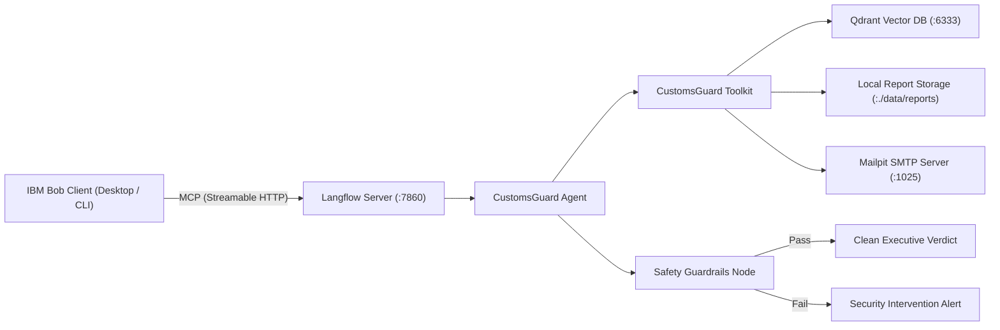

# CustomsGuard Technical Architecture & Pipeline Specification

This document provides a technical specification of the CustomsGuard system topology, Langflow canvas pipeline, safety guardrails layer, and Model Context Protocol (MCP) interface with IBM Bob.

## 1. System Topology Overview

CustomsGuard combines an autonomous execution engine running in local Docker containers with IBM Bob as the conversational orchestrator:

## 2. Langflow Visual Canvas Specification

The Langflow visual canvas integrates six core nodes designed for deterministic execution and enterprise safety:

### Node 1: Chat Input

- **Type**: Input Component.
- **Function**: Accepts raw commercial invoice JSON strings or trade shipment metadata from IBM Bob.
- **Schema**: Contains `shipment_id`, `importer_name`, `container_count`, and line `items` array.

### Node 2: CustomsGuard Tools (Custom Toolkit Component)

- **Type**: Custom Python Component (`CustomsGuardToolkitComponent`).
- **Source Code**: [`scripts/customs_components.py`](../../scripts/customs_components.py).
- **Exposed Tools**:
  1. `audit_shipment_compliance`: Queries 5,612 Indonesian HS-6 codes in Qdrant, detects tariff discrepancies, checks Lartas permits, calculates duty shortfalls, and evaluates container detention risk.
  2. `export_compliance_report`: Generates timestamped Markdown and JSON dossiers on local storage.
  3. `send_compliance_alert`: Dispatches urgent SMTP alerts to Mailpit (`localhost:1025`).

### Node 3: Agent Orchestrator

- **Type**: Autonomous Agent Component (`Agent`).
- **Language Model**: `openai/gpt-4o-mini` (configured via OpenRouter / Model Providers).
- **Instructions**: Defined in [`prompts/system_agent_instruction.md`](../../prompts/system_agent_instruction.md).
- **Behavior**: Evaluates discrepancies, decides when to export reports, and triggers alerts on high-risk violations.

### Node 4: Safety Guardrails Node

- **Type**: Safety Verification Component (`Guardrails`).
- **Input**: Connected from Agent `Response`.
- **Checking Method**: `AI checks`.
- **Language Model**: `openai/gpt-4o-mini`.
- **Active Guardrail Policies**:
  - `PII`: Sanitizes individual tax IDs (NPWP), commercial bank accounts, and private phone numbers.
  - `Tokens/Passwords`: Prevents leakage of backend SMTP credentials or API keys.
  - `Prompt Injection`: Neutralizes adversarial instructions embedded in invoice descriptions.
  - `Jailbreak`: Prevents evasion of customs compliance audit rules.

### Node 5: Chat Output (Pass Path)

- Connected to Guardrails `Pass` output handle.
- Formats and delivers the final executive audit summary, item findings table, and actions taken to the compliance officer.

### Node 6: Chat Output (Fail Path)

- Connected to Guardrails `Fail` output handle.
- Displays policy violation notices or blocked payload warnings when input content violates safety guidelines.

## 3. Model Context Protocol (MCP) Interface

CustomsGuard exposes its complete pipeline as a standardized Model Context Protocol (MCP) tool using the Streamable HTTP transport.
For complete step-by-step connection instructions and active client configuration, refer to [`docs/technical/mcp_setup.md`](./mcp_setup.md) and [`.bob/mcp.json`](../../.bob/mcp.json).

### Tool Specification

- **Tool Name**: `customsguard`
- **Transport**: `streamablehttp` via `mcp-proxy` (`mcp<2.0.0`)
- **Input Parameters**:
  - `input_value`: Serialized JSON invoice string or natural-language audit instruction.
  - `session_id`: Optional identifier to persist compliance state across multi-turn sessions.

### Execution Flow

1. Bob receives the user audit command (e.g. `$audit-shipment SHP-2026-0042` or pasted invoice payload).
2. Bob makes an MCP tool call to `customsguard` hosted on the Langflow server.
3. Langflow executes the visual pipeline, querying Qdrant tariffs, generating audit reports, and queuing Mailpit alerts.
4. Langflow passes the synthesized audit through the Guardrails safety filter.
5. Bob receives the sanitized verdict stream and renders the executive summary to the compliance officer.
